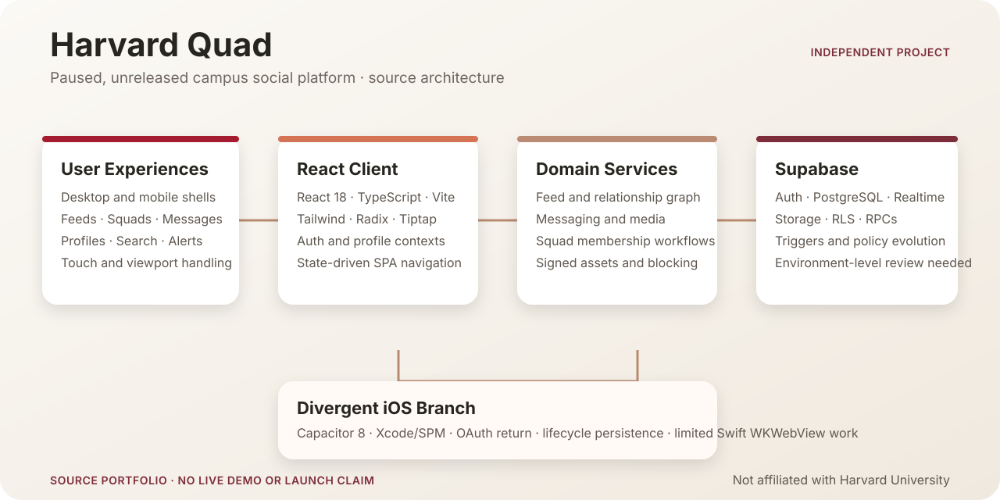

# Harvard Quad

Harvard Quad is an independent campus social platform that brings feeds, realtime messaging, student communities, profiles, and discovery into one React/TypeScript application backed by Supabase and PostgreSQL. The project reached substantial pre-launch implementation; a public demo is not currently available. Harvard Quad is not owned, sponsored, commissioned, or endorsed by Harvard University or any Harvard school.

## Role and Collaboration

Justin Li served as **Primary Engineer**, leading most implementation across feeds, messaging, Squads, profiles, mobile workflows, Supabase integration, and the later architecture expansion. A collaborator contributed to early profile, authentication, messaging, and mobile-interface work.

## Product Scope

The current `main` source includes:

- Campus, custom, and friends feeds with rich-text, image, link, and poll posts
- Nested replies, reactions, sharing, reports, mentions, pins, and Realtime updates
- Direct and group messaging with read state, pagination, media, mute/hide controls, and virtualized history
- Open, restricted, and private Squads with invitations, join requests, roles, feeds, chat, and documents
- Profiles, friends, blocking, notifications, Explore, and global search
- Separate desktop and mobile shells with touch drawers, safe-area handling, and mobile keyboard/viewport work

The calendar is an early prototype.

## Architecture



The diagram summarizes the architecture visible in this repository.

- **Client:** React 18, TypeScript, Vite, Tailwind CSS, Radix UI, Tiptap, and TanStack Virtual
- **Application services:** feed, messaging, Squads, profiles, friends, notifications, blocking, and signed-asset helpers
- **Backend design:** Supabase Auth, PostgreSQL, Realtime, Storage, Row Level Security, triggers, and database functions
- **Mobile web:** dedicated navigation and layouts, Visual Viewport handling, safe areas, touch drawers, and local UI-library patches
- **Deployment:** Vercel SPA configuration

## Web and iOS Implementations

`main` contains the latest and most complete web and mobile-web implementation. The public `IOS-branch` preserves an earlier iOS packaging effort that combines the React/Vite application with Capacitor 8 and an Xcode/SPM wrapper. It includes a custom URL scheme, Google OAuth return handling, lifecycle-state persistence, and limited Swift WKWebView customization.

## Local Setup

Use Node.js 20.

```bash
npm ci
cp .env.example .env.local
npm run dev
```

Provide credentials for a Supabase project you control:

```dotenv
VITE_SUPABASE_URL=
VITE_SUPABASE_ANON_KEY=
```

Validate the source:

```bash
npm run check
npm run build
```

Authentication and data workflows require a compatible Supabase backend.

## License and Contributions

The repository is publicly available for technical evaluation under the proprietary [LICENSE](LICENSE). External contributions are not currently accepted.
